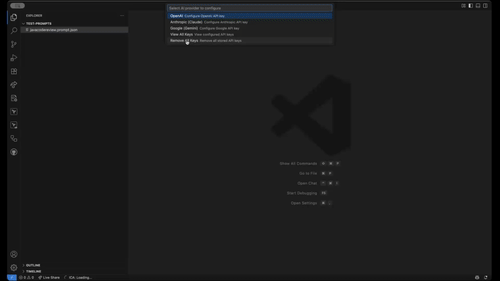

# Prompt Management Studio

## 🎯 **Structured Prompt Development for VS Code**

A VS Code extension that brings engineering discipline to prompt creation. Write prompts in a standardized JSON format, test across multiple AI providers, and manage them with Git workflows.

## 🚀 **What It Does**

### **Structured Prompt Composition**
- **Separate sections** for persona, instructions, examples, chain-of-thought
- **Enforces best practices** through schema (not just free-form text)
- **Guided prompt engineering** with distinct fields for each component
- Built-in validation and IntelliSense support
- Git-friendly format for version control

### **Multi-Provider Testing**
- Test prompts across OpenAI, Anthropic, and Google models
- Side-by-side comparison of responses
- Built-in cost estimation and performance tracking
- No vendor lock-in - switch providers easily

### **Developer Experience**
- Native VS Code integration
- Visual prompt builder interface
- Template variables with `{{variable}}` syntax
- Real-time testing and evaluation
- Command palette integration

### **Schema Validation** 🔒
- Automatic detection of breaking changes in prompt variables
- Compatibility scoring (0-100%) for prompt modifications
- Pre-save validation prevents production issues
- Detailed migration guidance for variable changes

## 📋 **Structured Prompt Composition**

Unlike other tools that store prompts as simple text strings, we use **structured sections** that enforce prompt engineering best practices:

```json
{
  "title": "Code Review Assistant",
  "prompt": {
    "persona": {
      "role": "You are a senior software engineer",
      "tone": "Professional and constructive"
    },
    "instructions": [
      "Review the provided code for potential issues",
      "Focus on security, performance, and maintainability",
      "Provide specific recommendations for improvement"
    ],
    "few_shot_examples": [
      {
        "input": "function add(a, b) { return a + b }",
        "output": "Consider adding input validation and type checking..."
      }
    ],
    "chain_of_thought": [
      "First, analyze the code structure and logic",
      "Then, identify potential security vulnerabilities",
      "Finally, suggest specific improvements"
    ]
  },
  "user_input_template": "Review this {{language}} code:\n\n{{code}}",
  "variables": [
    {
      "name": "code",
      "type": "string",
      "required": true,
      "description": "Source code to review"
    },
    {
      "name": "language",
      "type": "string", 
      "required": true,
      "description": "Programming language"
    }
  ],
  "test_cases": [
    {
      "name": "Python Security Issue",
      "inputs": {
        "code": "user_input = input('Enter filename: ')\nopen(user_input, 'r')",
        "language": "python"
      }
    }
  ],
  "models": ["gpt-4o", "claude-3-5-sonnet-20240620"]
}
```

## 🎬 **See It In Action**



**Complete walkthrough showing:**
- Creating a Python code review prompt from scratch
- Testing across multiple AI providers (GPT-4, Claude, Gemini)  
- Comparing responses and performance metrics
- Exporting and sharing prompts with your team

*[📹 Download full quality video](examples/Prompt%20Studio-demo.mp4) for offline viewing*

## 🛠️ **Installation**

### **Install Extension**
```bash
code --install-extension examples/prompt-management-studio-0.2.0.vsix
```

### **Configure API Keys**
1. Open Command Palette (`Ctrl+Shift+P` / `Cmd+Shift+P`)
2. Run `Prompt Studio: Configure API Keys`
3. Add your API keys for OpenAI, Anthropic, and/or Google

### **Quick Start**
1. Create a new file with `.prompt.json` extension
2. VS Code automatically opens the visual builder
3. Fill in your prompt details using the form interface
4. Test with different AI models using the "Test Now" button
5. Save and commit to Git like any other code file

**🎯 Get started in under 5 minutes!** See our [Quick Start Guide](docs/quick-start.md) for detailed instructions.

## 🔧 **Key Features**

### **Guided Prompt Builder**
- **Section-by-section creation** (persona → instructions → examples → chain-of-thought)
- **Best practice enforcement** through structured fields
- No need to write JSON manually
- Real-time preview and validation
- Drag-and-drop interface for examples

### **Testing Framework**
- One-click testing across multiple models
- Performance and cost comparison
- Test case management
- Evaluation history tracking

### **Version Control Integration**
- Git-native JSON format
- Meaningful diffs for prompt changes
- Branch-based development workflows
- Schema validation prevents breaking changes

### **Template System**
- Variable substitution with `{{variable}}` syntax
- Type checking and validation
- Default values and descriptions
- Auto-completion in VS Code

## 📊 **Schema Validation**

When you modify prompt variables, the system automatically:
- Detects breaking changes (removed required variables, type changes)
- Shows compatibility score and impact assessment
- Provides migration guidance for code updates
- Prevents accidental production breaks

Example: Changing `{{user_query}}` to `{{question}}` triggers a breaking change alert with specific migration steps.

## 🎯 **Use Cases**

### **Individual Developers**
- **Structure ad-hoc prompts** with guided sections (persona, instructions, examples)
- **Learn prompt engineering** through enforced best practices
- Test prompts across different AI providers
- Version control prompts alongside code
- Prevent breaking changes with schema validation

### **Development Teams**
- Standardize prompt format across projects
- Share and reuse prompt templates
- Code review prompts using Git workflows
- Maintain prompt quality with built-in testing

### **Organizations**
- Establish prompt engineering standards
- Build internal prompt libraries
- Integrate with existing development workflows
- Migrate to enterprise platforms when ready

## 🔗 **Integration**

The JSON format is designed to be:
- **Portable**: Export to other prompt management platforms
- **Standard**: Based on common prompt engineering patterns
- **Extensible**: Add custom fields as needed
- **Tool-agnostic**: Works with any system that accepts JSON

## 📚 **Documentation**

### **For Users**
- **[📖 Quick Start Guide](docs/quick-start.md)** - Get up and running in 5 minutes
- **[🔒 Schema Validation Guide](docs/schema-validation.md)** - Prevent breaking changes with variable validation
- **[📋 User Guide](docs/user-guide.md)** - Complete guide for using the extension
- **[🔧 Troubleshooting](docs/troubleshooting.md)** - Solutions to common issues

### **For Developers**
- **[🏗️ Architecture](docs/architecture.md)** - System design and component overview
- **[⚙️ Technology Stack](docs/technology-stack.md)** - Technical implementation details
- **[🔌 API Reference](docs/api-reference.md)** - Complete API documentation
- **[💻 Development Setup](docs/development-setup.md)** - Local development environment

### **Project Information**
- **[📝 Release Notes](docs/release-notes.md)** - Latest updates and improvements
- **[💡 Example Prompts](examples/)** - Sample prompts and templates
- **[🤝 Contributing Guide](CONTRIBUTING.md)** - How to contribute to the project

## 🤝 **Contributing**

This is an open-source project. Contributions welcome for:
- New prompt templates
- Additional AI provider integrations
- Schema validation improvements
- Documentation and examples

## 📄 **License**

MIT License - Use freely in personal and commercial projects.
